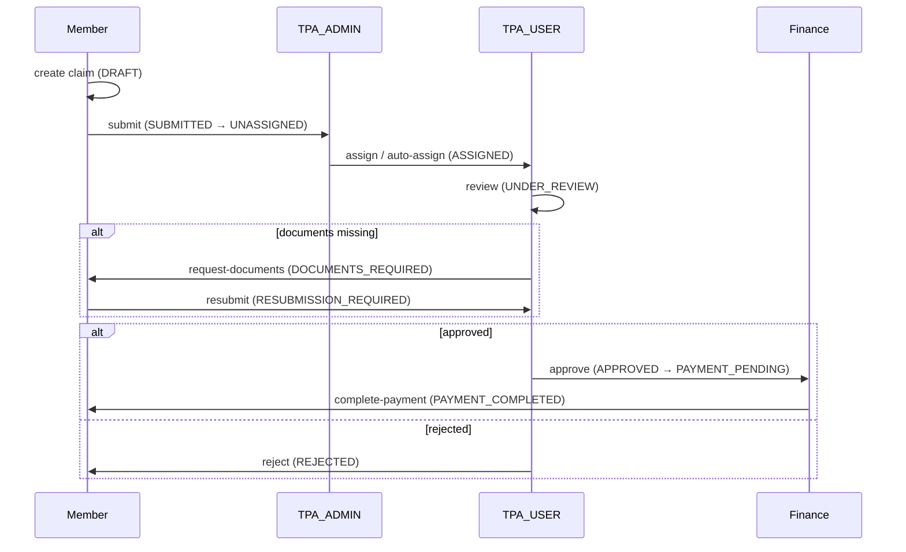

# OPD Wallet — User Flows by Portal and Role

Complete map of every portal, every role, every responsibility that role can perform,
and the flows those responsibilities sit inside.

Derived from source: route trees under `web-*/app/`, `@Roles()` decorators on
`api/src/modules/**/*.controller.ts`, and the status enums in
`api/src/modules/memberclaims/schemas/memberclaim.schema.ts`.

---

## 1. Identity model

Three separate identity stores, three separate login endpoints. This is the single
most important thing to understand before reading any flow below.

| Identity | Collection | Login endpoint | Password field |
|---|---|---|---|
| Internal staff | `internal_users` | `POST /api/auth/login` | `passwordHash` |
| Members (patients) | `users` | `POST /api/auth/login` | `passwordHash` |
| Doctors | `doctors` | `POST /api/auth/doctor/login` | `password` |

Internal staff and members share the login endpoint (resolved by
`common/services/unified-user.service.ts`); doctors have their own controller at
`@Controller('auth/doctor')`.

Shared session endpoints: `POST /api/auth/refresh`, `POST /api/auth/logout`,
`GET /api/auth/me`. Session is a JWT in the httpOnly cookie `opd_session`.

Doctors additionally require `isActive: true` to log in.

### Roles

Ten roles, defined in `api/src/common/constants/roles.enum.ts`:

```
SUPER_ADMIN  ADMIN
TPA_ADMIN    TPA_USER
FINANCE_ADMIN FINANCE_USER
OPS_ADMIN    OPS_USER
MEMBER       DOCTOR
```

### Role → portal map

| Portal | Port | Base path | Roles that can use it |
|---|---|---|---|
| Admin | 3001 | `/admin` | `SUPER_ADMIN`, `ADMIN` |
| Member (web) | 3002 | — | `MEMBER` |
| Doctor | 3003 | `/doctor` | `DOCTOR` |
| TPA | 3004 | `/tpa` | `TPA_ADMIN`, `TPA_USER` |
| Operations | 3005 | `/operations` | `OPS_ADMIN`, `OPS_USER` |
| Finance | 3006 | `/finance` | `FINANCE_ADMIN`, `FINANCE_USER` |
| Member (mobile) | Expo | — | `MEMBER` |

`SUPER_ADMIN` and `ADMIN` appear in the `@Roles()` list of nearly every controller
(167 and 148 references respectively), so they can exercise most staff
responsibilities through the API regardless of which portal UI exposes them.

---

## 2. Admin portal (port 3001)

**Who logs in:** `SUPER_ADMIN`, `ADMIN`
**Purpose:** platform configuration and master data. Admin defines *what exists*;
Operations runs *what happens day to day*.

### Responsibilities

**Policy and benefit design**
- Create and edit policies — `/policies`, `/policies/new`, `/policies/[id]`
- Configure plan benefits per policy, with versioning — `/policies/[id]/plan-config`, `/plan-config/[version]`
- Assign policies to corporates/members — `/policies/[id]/assignments`

**User administration**
- Create, view, edit internal users — `/users`, `/users/new`, `/users/[id]`
- Controller: `internal-users.controller.ts` (`ADMIN`, `SUPER_ADMIN` only)

**Master data**
- Service catalogue — `/services`, `/masters`
- Categories and category↔service / category↔specialty mappings — `/categories`
- CUGs (closed user groups) — `/cugs`
- Relationships, specialties

**Network management**
- Clinics — `/network-management/clinics/new`, `/clinics/[id]`
- Doctors — `/network-management/doctors/new`, `/doctors/[id]`

**Diagnostics verticals** — identical structure repeated four times:
`/pathology`, `/radiology`, `/vaccination`, and AHC (`/ahc`)
- Master tests — `/{vertical}/master-tests`
- Services — `/{vertical}/services`
- Vendors — `/{vertical}/vendors`
- Per-vendor pricing — `/{vertical}/vendors/[vendorId]/pricing`
- Per-vendor slots — `/{vertical}/vendors/[vendorId]/slots`
- Per-vendor test aliases — pathology only: `/pathology/vendors/[vendorId]/aliases`

### SUPER_ADMIN vs ADMIN

Unlike TPA and Operations, this split is **not** a clean supervisor/worker
division — it is uneven and, in one place, unsafe.

**Internal user management** (`internal-users.controller.ts`) — the sharpest split:

| Capability | Endpoint | SUPER_ADMIN | ADMIN |
|---|---|---|---|
| Create internal user | `POST /internal-users` | ✓ | — |
| List internal users | `GET /internal-users` | ✓ | — |
| View internal user | `GET /internal-users/:id` | ✓ | — |
| Delete internal user | `DELETE /internal-users/:id` | ✓ | — |
| Update internal user | `PUT /internal-users/:id` | ✓ | ✓ |
| **Reset password** | `POST /internal-users/:id/reset-password` | ✓ | ✓ |

`ADMIN` cannot list or view internal users, but **can** update them and reset
their passwords given an ID — including a `SUPER_ADMIN`'s. See §11.

**Other SUPER_ADMIN-only capabilities:**

| Capability | Endpoint |
|---|---|
| Toggle AHC package active | `PATCH /ahc/packages/:packageId/toggle-active` |
| Delete AHC package | `DELETE /ahc/packages/:packageId` |
| Data migrations | `migration.controller.ts` (whole controller) |
| Service catalogue migration | `services-migration.controller.ts` (whole controller) |

**Shared equally by SUPER_ADMIN and ADMIN** — the bulk of the Admin portal:
policies (full CRUD, `policies.controller.ts`), plan-config, policy-services-config,
services, categories, category mappings, CUGs, specialties, assignments, and AHC
package create/read/update.

The recurring pattern: **ADMIN configures, SUPER_ADMIN destroys and toggles.**
Deletion and activation switches are consistently reserved — same instinct as the
Operations split, applied one level up.

### ADMIN — daily flow
```
Login → /admin
  → configure policies (/policies) and plan versions (/policies/[id]/plan-config)
  → assign policies to CUGs (/policies/[id]/assignments)
  → maintain master data: services, categories, specialties, CUGs
  → maintain network: clinics, doctors
  → maintain the four diagnostics verticals: master tests → vendors → pricing → slots
```

### SUPER_ADMIN — additional flow
```
  → create/list/delete internal staff accounts (/users)
  → toggle or delete AHC packages
  → run data and catalogue migrations
```

### Flow — onboarding a corporate client

```
Admin creates policy
  → configures plan-config (benefits, limits, co-pay) — versioned
  → assigns policy to CUG / corporate
  → members inherit benefits
  → member sees them at /member/benefits
```

### Flow — onboarding a diagnostics vendor

```
Admin creates master tests (canonical catalogue)
  → creates vendor
  → sets vendor pricing per test
  → defines vendor slots (capacity/availability)
  → maps vendor aliases to master tests   [pathology only]
  → vendor becomes selectable to members at cart → vendor selection
```

---

## 3. Operations portal (port 3005)

**Who logs in:** `OPS_ADMIN`, `OPS_USER`
**Purpose:** daily fulfilment. Operations touches live bookings, prescriptions
and the provider network.

### Responsibilities

**Network operations**
- Clinics — `/clinics`, `/clinics/new`, `/clinics/[id]`
- Doctors — `/doctors`, `/doctors/new`, `/doctors/[id]`
- Doctor schedules — `/doctors/[id]/schedules` (`doctor-slots.controller.ts`)
- Doctor↔clinic assignments — `doctor-clinic-assignments.controller.ts`

**Member support**
- View and assist members — `/members`, `/members/[id]`
- Read access via `members.controller.ts`

**Bookings**
- Appointments across all services — `/appointments`
- Orders — `/orders`
- Dental service pricing — `/dental-services`
- Vision services — `/vision-services`

**Prescription digitisation** — the operational core:
- Queue — `/prescriptions`
- Digitise per vertical — `/pathology/prescriptions/[id]/digitize`,
  `/radiology/...`, `/diagnostics/...`, `/lab/...`

**Vendor management** — same four-vertical structure as Admin
(`/pathology`, `/radiology`, `/vaccination`), including master tests, services,
vendors, pricing, slots, aliases.

### OPS_ADMIN vs OPS_USER

The dividing line is **provider lifecycle**. `OPS_USER` can create and edit
providers; only `OPS_ADMIN` can switch them on or off. Neither can delete.

| Capability | Endpoint | OPS_ADMIN | OPS_USER |
|---|---|---|---|
| Create clinic | `POST /clinics` | ✓ | ✓ |
| List / view clinic | `GET /clinics`, `/:clinicId` | ✓ | ✓ |
| Update clinic | `PUT /clinics/:clinicId` | ✓ | ✓ |
| **Activate clinic** | `PATCH /clinics/:clinicId/activate` | ✓ | — |
| **Deactivate clinic** | `PATCH /clinics/:clinicId/deactivate` | ✓ | — |
| Delete clinic | `DELETE /clinics/:clinicId` | — | — (ADMIN/SUPER_ADMIN only) |
| Create doctor | `POST /doctors` | ✓ | ✓ |
| Upload doctor photo | `POST /doctors/:doctorId/photo` | ✓ | ✓ |
| Update doctor | `PUT /doctors/:doctorId` | ✓ | ✓ |
| Set doctor password | `POST /doctors/:doctorId/set-password` | ✓ | ✓ |
| **Activate doctor** | `PATCH /doctors/:doctorId/activate` | ✓ | — |
| **Deactivate doctor** | `PATCH /doctors/:doctorId/deactivate` | ✓ | — |

Everything else in Operations is **shared equally** — both roles carry identical
rights across the entire fulfilment workflow, because those controllers set roles
at class level with no per-method overrides:

- `lab-ops.controller.ts` — prescription queue, digitise, eligible-vendors,
  status, cancel, orders, confirm, collect, upload reports, complete
- `diagnostic-ops.controller.ts` — same set plus `prescriptions/:id/delay` and
  `carts/:cartId/display`
- `appointments.controller.ts` — list, confirm, cancel
- `operations.controller.ts` — dashboard stats, member search, member detail,
  **and wallet top-up**

### OPS_USER — the fulfilment operator

**Daily flow:**
```
Login → dashboard stats (/operations)
  → work the prescription queue (/prescriptions)
      → open a prescription, check eligible vendors
      → digitize: map handwritten tests → master tests
      → cart created for member
  → work the order pipeline (/orders)
      → confirm → collect → upload reports → complete
      → or cancel / delay
  → handle appointments (/appointments): confirm or cancel
  → assist members (/members/[id]), including wallet top-up
```

### OPS_ADMIN — the operations supervisor

Everything above, **plus** provider lifecycle:
```
  → onboard clinic (/clinics/new) → activate it
  → onboard doctor (/doctors/new) → set schedule → activate
  → deactivate a provider who is unavailable or off-network
```
Deactivation is the lever that removes a doctor or clinic from member-facing
booking without deleting records — which is why it is admin-gated.

### Flow — prescription digitisation

```
Member uploads prescription image  (/member/lab-tests/upload)
  → lands in Operations queue      (/prescriptions)
  → Ops opens digitize screen      (/pathology/prescriptions/[id]/digitize)
  → maps handwritten tests to master tests (via vendor aliases)
  → creates cart for the member
  → member selects vendor + slot   (/member/lab-tests/cart/[id]/vendor/[vendorId])
  → order confirmed                (/member/lab-tests/orders/[orderId])
```

### Flow — AHC (annual health checkup) order

Per `ahc-admin.controller.ts`:
```
Order created
  → complete-collection   (sample collected)
  → reports/upload | upload-lab | upload-diagnostic
  → status PATCH / cancel
  → member views report   (/member/health-records)
```

---

## 4. TPA portal (port 3004)

**Who logs in:** `TPA_ADMIN`, `TPA_USER`
**Purpose:** adjudicate reimbursement claims. This portal owns the middle of the
claim lifecycle.

### Responsibilities

| Capability | Route | Endpoint | TPA_ADMIN | TPA_USER |
|---|---|---|---|---|
| List all claims | `/claims` | `GET /tpa/claims` | ✓ | ✓ |
| Unassigned queue | `/claims/unassigned` | `GET /tpa/claims/unassigned` | ✓ | — |
| Assigned queue | `/claims/assigned` | `GET /tpa/claims/assigned` | ✓ | — |
| Claim detail | `/claims/[claimId]` | `GET /tpa/claims/:claimId` | ✓ | ✓ |
| Assign to processor | — | `POST /tpa/claims/:claimId/assign` | ✓ | — |
| Auto-assign batch | — | `POST /tpa/claims/auto-assign` | ✓ | — |
| Reassign | — | `POST /tpa/claims/:claimId/reassign` | ✓ | — |
| Change status | — | `PATCH /tpa/claims/:claimId/status` | ✓ | ✓ |
| Approve | — | `POST /tpa/claims/:claimId/approve` | ✓ | ✓ |
| Reject | — | `POST /tpa/claims/:claimId/reject` | ✓ | ✓ |
| Request documents | — | `POST /tpa/claims/:claimId/request-documents` | ✓ | ✓ |
| Analytics | `/analytics` | `GET /tpa/analytics/summary` | ✓ | ✓ |
| Team users | `/users` | `GET /tpa/users` | ✓ | — |
| Recent activity | — | `GET /tpa/recent-activity` | ✓ | ✓ |

**The split is clean:** `TPA_ADMIN` distributes work (assign, auto-assign, reassign,
see queues, see team). `TPA_USER` does the work (review, approve, reject, request
documents) but cannot assign or see the unassigned pool.

### TPA_ADMIN — the supervisor

Everything `TPA_USER` can do, **plus** four exclusive capabilities. All four are
about *work distribution*, never about the claim decision itself.

| Exclusive capability | Endpoint |
|---|---|
| See the unassigned pool | `GET /tpa/claims/unassigned` |
| See who holds what | `GET /tpa/claims/assigned` |
| Assign a claim to a processor | `POST /tpa/claims/:claimId/assign` |
| Bulk auto-assign | `POST /tpa/claims/auto-assign` |
| Move a claim between processors | `POST /tpa/claims/:claimId/reassign` |
| See the TPA team roster | `GET /tpa/users` |

**Daily flow:**
```
Login → dashboard (/tpa)
  → open unassigned queue (/tpa/claims/unassigned)
  → either: auto-assign the batch
     or:    assign claim-by-claim to a named TPA_USER
  → monitor assigned queue (/tpa/claims/assigned)
  → reassign anything stuck or on a processor who is unavailable
  → review analytics (/tpa/analytics) for throughput and ageing
```

A `TPA_ADMIN` can also adjudicate directly — they hold every `TPA_USER`
permission — so a small team can run with one admin doing both jobs.

### TPA_USER — the claim processor

Cannot see the unassigned pool at all. Work only arrives by being assigned.

| Capability | Endpoint |
|---|---|
| List claims (own) | `GET /tpa/claims` |
| Open a claim | `GET /tpa/claims/:claimId` |
| Change status | `PATCH /tpa/claims/:claimId/status` |
| Approve (full or partial) | `POST /tpa/claims/:claimId/approve` |
| Reject | `POST /tpa/claims/:claimId/reject` |
| Ask member for documents | `POST /tpa/claims/:claimId/request-documents` |
| Analytics | `GET /tpa/analytics/summary` |
| Recent activity | `GET /tpa/recent-activity` |

**Daily flow:**
```
Login → dashboard (/tpa)
  → open assigned claims (/tpa/claims)
  → open a claim (/tpa/claims/[claimId])
  → set UNDER_REVIEW
  → inspect documents, bills, policy entitlement
  → one of three outcomes:
       documents missing  → request-documents  (DOCUMENTS_REQUIRED)
                             → member resubmits → back to review
       payable            → approve            (APPROVED / PARTIALLY_APPROVED)
                             → PAYMENT_PENDING → handed to Finance
       not payable        → reject             (REJECTED, terminal)
```

**What neither TPA role can do:** pay. Approval moves the claim to
`PAYMENT_PENDING` and control passes to Finance. This is the system's main
separation-of-duties boundary.

---

## 5. Finance portal (port 3006)

**Who logs in:** `FINANCE_ADMIN`, `FINANCE_USER`
**Purpose:** disburse money for claims TPA has already approved. The smallest
portal — three routes.

### Responsibilities

| Capability | Route | Endpoint |
|---|---|---|
| Pending payouts | `/payments/pending` | `GET /finance/claims/pending` |
| Claim detail | — | `GET /finance/claims/:claimId` |
| Complete payment | — | `POST /finance/claims/:claimId/complete-payment` |
| Payment history | `/payments/history` | `GET /finance/payments/history` |
| Analytics | `/` (dashboard) | `GET /finance/analytics/summary` |

### FINANCE_ADMIN vs FINANCE_USER

**There is no difference.** Every one of the five endpoints in
`finance.controller.ts` carries the identical decorator:

```ts
@Roles(UserRole.FINANCE_ADMIN, UserRole.FINANCE_USER,
       UserRole.SUPER_ADMIN, UserRole.ADMIN)
```

No method-level override anywhere in the controller. The two roles are
interchangeable in practice — a `FINANCE_USER` can disburse payment exactly as a
`FINANCE_ADMIN` can.

This is the odd one out. TPA gates *assignment*, Operations gates *activation*,
Admin gates *deletion* — Finance gates nothing, on the one portal that moves
money. If a maker/checker split is intended, it does not exist yet. See §11.

### Finance — daily flow (both roles identically)
```
Login → dashboard (/finance) with analytics summary
  → open pending payouts (/finance/payments/pending)
      [claims TPA has already moved to PAYMENT_PENDING]
  → open a claim to verify approved amount and member bank details
  → complete-payment  → PAYMENT_PROCESSING → PAYMENT_COMPLETED
  → reconcile against history (/finance/payments/history)
```

Finance cannot approve or reject a claim; it only acts on claims already in a
payment-pending state. It has no visibility of claims earlier in the lifecycle.

---

## 6. Doctor portal (port 3003)

**Who logs in:** `DOCTOR` (separate `doctors` collection, `isActive: true` required)
**Purpose:** conduct consultations and issue prescriptions.

### Responsibilities

- Dashboard — `/doctorview`
- Appointments list and detail — `/doctorview/appointments`, `/appointments/[appointmentId]`
  (`doctor-appointments.controller.ts`, DOCTOR only)
- Calendar and availability — `/doctorview/calendar` (`doctor-calendar.controller.ts`, DOCTOR only)
- Conduct consultation — `/doctorview/consultations/[appointmentId]`
  (`consultation-note.controller.ts`, DOCTOR only)
- Prescriptions — `/doctorview/prescriptions`, `/prescriptions/[prescriptionId]`
- Prescription templates — `prescription-template.controller.ts` (DOCTOR only)
- Profile and digital signature — `/doctorview/profile`
  (`POST /auth/doctor/profile/signature`, signature status/retrieval)
- Video consultation — `video-consultation.controller.ts` (shared `DOCTOR` + `MEMBER`)

Shared with members: `prescriptions.controller.ts` and
`digital-prescription.controller.ts` are `@Roles(DOCTOR, MEMBER)` — the doctor
writes, the member reads.

### Every doctor flow, step by step

**D1 — Login and first-time signature setup**
```
/doctor/login (POST /api/auth/doctor/login)
   → requires isActive: true, else login refused
   → /doctorview dashboard
   → first run: /doctorview/profile → upload digital signature
        (POST /auth/doctor/profile/signature)
   → signature status checked before prescriptions can be issued
```

**D2 — Review the day**
```
/doctorview                     dashboard summary
   → /doctorview/appointments   today's list
   → /doctorview/appointments/[appointmentId]   patient + booking detail
```

**D3 — Manage availability**
```
/doctorview/calendar
   → view booked vs free slots
   → slots originate from Operations (/doctors/[id]/schedules)
   → doctor sees availability; Operations owns the schedule
```

**D4 — Conduct a consultation**
```
/doctorview/consultations/[appointmentId]
   → review patient history and prior records
   → record consultation note (consultation-note.controller.ts)
   → diagnose, advise
   → issue prescription (D5) or close
```

**D5 — Issue a prescription**
```
from the consultation screen
   → optionally start from a saved template
        (prescription-template.controller.ts)
   → add medicines, dosage, duration
   → add lab/diagnostic tests if required
   → sign digitally with stored signature
   → /doctorview/prescriptions/[prescriptionId]
   → member reads it at /member/consultations/[appointmentId]
   → any tests ordered can flow into the member's lab/diagnostic funnel
```

**D6 — Prescription history**
```
/doctorview/prescriptions → all issued prescriptions → open any by id
```

**D7 — Video consultation**
```
online appointment → video-consultation.controller.ts (DOCTOR + MEMBER)
   → join session with member
   → then D4 / D5 as normal
```

**D8 — Profile maintenance**
```
/doctorview/profile → personal details, qualifications, signature
```

**What a doctor cannot do:** see other doctors' appointments, alter their own
schedule (Operations owns it), or access any member who is not booked with them.

---

## 7. Member portal (port 3002 web, Expo mobile)

**Who logs in:** `MEMBER`
**Purpose:** consume health benefits. By far the largest surface — ~60 web routes.

Members can act **for themselves or for a dependent**. The active profile is held
in `FamilyContext` (`viewingUserId`, persisted to storage) and switching it fires a
PHI audit event via `auditLogger.profileSwitch()`.

### Responsibilities by area

**Identity and family**
- Profile — `/member/profile`; settings — `/member/settings`
- Family members — `/member/family`, `/member/family/add`
- Switch active profile — governs every flow below

**Benefits and wallet**
- Benefits — `/member/benefits`; policy detail — `/member/policy-details/[policyId]`
- Wallet balance — `/member/wallet` (`wallet.controller.ts`, MEMBER only)
- Transactions — `/member/transactions` (`transaction-summary.controller.ts`)
- Orders and payments — `/member/orders`, `/orders/[transactionId]`, `/payments/[paymentId]`

**Consultations**
- In-clinic: specialties → doctors → select patient → select slot → confirm
  (`/member/appointments/*`)
- Online: specialties → doctors → confirm (`/member/online-consult/*`)
- View consultation — `/member/consultations/[appointmentId]`

**Diagnostics — three parallel funnels** (lab-tests, diagnostics, AHC)
- Browse — `/member/lab-tests`
- Upload prescription — `/member/lab-tests/upload`
- Cart — `/member/lab-tests/cart/[id]`
- Choose vendor — `/cart/[id]/vendor/[vendorId]`
- Book slot — `/booking/[cartId]`
- Orders — `/orders`, `/orders/[orderId]`

**Specialist services** — each with its own select-patient → select-slot → confirm funnel
- Dental — `/member/dental/*` (clinics, select-patient, select-slot, confirm)
- Vision — `/member/vision/*` (+ `payment/[bookingId]`)
- AHC — `/member/ahc/booking`, `/booking/diagnostic`, `/booking/payment`
- Vaccination — mobile app only (`select-vendor` step)

**Claims (reimbursement)**
- Submit — `/member/claims/new`
- Track — `/member/claims`, `/member/claims/[id]`
- Resubmit documents when TPA requests them

**Other**
- Health records — `/member/health-records`
- Pharmacy — `/member/pharmacy`
- Wellness — `/member/wellness`
- Helpline — `/member/helpline`

### Every member flow, step by step

Every flow below begins with login and an active-profile selection. Where a flow
has a `select-patient` step, that step **overrides** the active profile for that
booking only.

**F1 — Login and session**
```
/  → login (email + password, POST /api/auth/login)
   → opd_session cookie set
   → FamilyContext loads profile + dependents
   → active member restored from storage (viewing_user_id) or defaults to self
   → /member dashboard
   → 15-min inactivity timeout → forced logout (HIPAA)
```

**F2 — Switch active profile**
```
/member (any screen) → profile switcher
   → choose family member
   → auditLogger.profileSwitch(from, to) fires  [PHI access event]
   → viewingUserId persisted to storage
   → all downstream data re-scoped to that member
```
Only available when the logged-in user is primary *and* has dependents.

**F3 — Add a family member**
```
/member/family → /member/family/add
   → enter name, relationship, DOB, gender
   → dependent created, appears in switcher and in select-patient lists
```

**F4 — In-clinic consultation**
```
/member/appointments
   → /appointments/specialties     pick specialty
   → /appointments/doctors         pick doctor
   → /appointments/select-patient  who is this for
   → /appointments/select-slot     pick date + slot
   → /appointments/confirm         confirm + pay
   → appointment created → Operations queue → doctor calendar
   → /member/consultations/[appointmentId]  view notes + prescription after visit
```

**F5 — Online consultation**
```
/member/online-consult
   → /online-consult/specialties
   → /online-consult/doctors
   → /online-consult/confirm
   → video consultation (video-consultation.controller.ts, DOCTOR + MEMBER)
```
Shorter than F4 — no clinic or slot selection.

**F6 — Lab tests, upload path**
```
/member/lab-tests → /lab-tests/upload
   → upload prescription image
   → enters Operations digitisation queue
   → Ops maps handwritten tests → master tests, builds cart
   → /member/lab-tests/cart/[id]           review cart
   → /lab-tests/cart/[id]/vendor/[vendorId] pick vendor (price varies by vendor)
   → /lab-tests/booking/[cartId]            pick collection slot
   → /lab-tests/orders/[orderId]            track order
   → reports uploaded by Ops → /member/health-records
```

**F7 — Lab tests, browse path**
```
/member/lab-tests → browse catalogue → add to cart
   → same from /lab-tests/cart/[id] onward as F6
```

**F8 — Diagnostics / radiology**
```
/member/diagnostics  (mobile: /radiology-cardiology)
   → /diagnostics/upload  or  browse
   → /diagnostics/cart/[id] → /cart/[id]/vendor/[vendorId]
   → /diagnostics/booking/[cartId]
   → /diagnostics/orders/[orderId]
```
Identical shape to F6, separate vertical and vendor pool.

**F9 — Annual health checkup (AHC)**
```
/member/health-checkup  (mobile: /health-packages)
   → /member/ahc/booking            choose package
   → /ahc/booking/diagnostic        choose diagnostic centre
   → /ahc/booking/payment           pay
   → Ops: complete-collection → upload reports
   → /member/health-records
```

**F10 — Dental**
```
/member/dental
   → /dental/clinics         pick clinic
   → /dental/select-patient
   → /dental/select-slot
   → /dental/confirm
```

**F11 — Vision**
```
/member/vision
   → /vision/clinics
   → /vision/select-patient
   → /vision/select-slot
   → /vision/confirm
   → /vision/payment/[bookingId]    separate payment step
```
The only specialist funnel with a dedicated post-confirm payment screen.

**F12 — Vaccination (mobile app only)**
```
/member/vaccination
   → /vaccination/select-patient
   → /vaccination/select-slot
   → /vaccination/select-vendor     extra step, unique to this funnel
   → /vaccination/confirm
```
No web equivalent exists.

**F13 — Submit a reimbursement claim**
```
/member/claims → /member/claims/new
   → choose claim type (IPD / OPD)
   → enter amount, treatment details, dates
   → upload bills and supporting documents
   → save DRAFT  or  submit → SUBMITTED → UNASSIGNED
   → enters TPA queue
```

**F14 — Track and resubmit a claim**
```
/member/claims                 list with statuses
   → /member/claims/[id]       detail + status history
   → if DOCUMENTS_REQUIRED:
        upload the requested documents
        → RESUBMISSION_REQUIRED → back to TPA review
   → if APPROVED → PAYMENT_PENDING → PAYMENT_COMPLETED
   → member may cancel before adjudication (CANCELLED)
```

**F15 — Wallet and transactions**
```
/member/wallet          balance and entitlement
/member/transactions    ledger of debits/credits
/member/orders          all orders → /orders/[transactionId]
/member/payments/[paymentId]   individual payment detail
```
Members cannot top up their own wallet — only Operations can (§3).

**F16 — Benefits and policy**
```
/member/benefits                     what is covered, limits, balances
   → /member/policy-details/[policyId]  full policy terms
```
Backed by `GET /policies/:id/current` — the one policies endpoint members may call.

**F17 — Health records**
```
/member/health-records
   → reports from lab/diagnostic/AHC orders
   → prescriptions from consultations
   → scoped to the active member
```

**F18 — Pharmacy**
```
/member/pharmacy → browse / order medicines
```

**F19 — Wellness**
```
/member/wellness  (mobile: /wellness-programs) → programmes and content
```

**F20 — Helpline**
```
/member/helpline → support contact
```

**F21 — Profile and settings**
```
/member/profile   personal details
/member/settings  preferences, session, notifications
```

**F22 — Notifications (mobile only)**
```
/member/notifications → alerts for orders, claims, appointments
```

### Web vs mobile differences

The Expo app is not a 1:1 port:

| Area | Web | Mobile |
|---|---|---|
| Vaccination booking | not present | present (`select-vendor` step) |
| Notifications | not present | `/member/notifications` |
| Carts (unified) | per-vertical | `/member/carts` |
| Radiology/cardiology | `/diagnostics` | `/radiology-cardiology` |
| In-clinic consult | `/appointments` | `/in-clinic-consultation` |
| Wellness | `/wellness` | `/wellness-programs` |
| Health checkup | `/health-checkup` | `/health-packages` |

Route naming diverges between the two clients for the same capability — worth
normalising in any rewrite.

---

## 8. The claim lifecycle — the one flow that crosses four portals

`ClaimStatus` has 14 states (`memberclaim.schema.ts:34-49`):

```
DRAFT → SUBMITTED → UNASSIGNED → ASSIGNED → UNDER_REVIEW
                                      ↓
              ┌───────────────────────┼───────────────────────┐
              ↓                       ↓                       ↓
      DOCUMENTS_REQUIRED          APPROVED /            REJECTED
              ↓                PARTIALLY_APPROVED
   RESUBMISSION_REQUIRED               ↓
              ↓                  PAYMENT_PENDING
        (back to review)               ↓
                               PAYMENT_PROCESSING
                                       ↓
                               PAYMENT_COMPLETED

CANCELLED — reachable by the member before adjudication
```

Ownership by portal:

| Stage | Portal | Role |
|---|---|---|
| `DRAFT` → `SUBMITTED` | Member | `MEMBER` |
| `UNASSIGNED` → `ASSIGNED` | TPA | `TPA_ADMIN` |
| `UNDER_REVIEW` → decision | TPA | `TPA_USER`, `TPA_ADMIN` |
| `DOCUMENTS_REQUIRED` → resubmit | TPA requests, Member supplies | both |
| `PAYMENT_PENDING` → `PAYMENT_COMPLETED` | Finance | `FINANCE_*` |

`PaymentStatus` is a separate enum with six states
(`PENDING, APPROVED, PROCESSING, COMPLETED, PAID, FAILED`). Note `COMPLETED` and
`PAID` overlap in meaning — a modelling ambiguity worth resolving.

`memberclaims.controller.ts` is the only controller carrying **eight** roles
(`ADMIN, FINANCE_USER, MEMBER, OPS_ADMIN, OPS_USER, SUPER_ADMIN, TPA_ADMIN, TPA_USER`),
which confirms claims as the system's main cross-cutting domain.



---

## 9. Booking lifecycle — Member → Operations → Doctor


Slot availability originates from Admin/Operations: doctor schedules
(`/doctors/[id]/schedules`) and vendor slots
(`/{vertical}/vendors/[vendorId]/slots`).

---

## 10. Portal responsibility summary

| Portal | Creates | Reads | Approves | Pays |
|---|---|---|---|---|
| Admin | policies, master data, network, vendors | everything | — | — |
| Operations | bookings, digitised prescriptions, schedules | members, orders | — | — |
| TPA | claim assignments, decisions | claims | claims | — |
| Finance | payment records | approved claims | — | claims |
| Doctor | consultation notes, prescriptions | own appointments | — | — |
| Member | claims, bookings, carts, family | own + dependents' data | — | — |

**Separation of duties holds** on the money path: the role that approves a claim
(TPA) cannot pay it, and the role that pays (Finance) cannot approve it.

---

## 11. Known gaps

### Sub-role design, compared

| Portal | What the admin role gates | Gate exists? |
|---|---|---|
| TPA | work assignment | yes — clean |
| Operations | provider activate/deactivate | yes — clean |
| Admin | delete + toggle | partial — see below |
| Finance | nothing | **no** |

### Privilege escalation path in internal-user management

`ADMIN` is denied `GET /internal-users` and `GET /internal-users/:id`, but is
allowed `POST /internal-users/:id/reset-password`. The read restriction is
therefore the only thing standing between an `ADMIN` and any other internal
account — including `SUPER_ADMIN`.

Obscurity of the target `_id` is not an access control. An `ADMIN` who obtains a
`SUPER_ADMIN`'s id from any other response, log, or URL can reset that password
and take over the account. `PUT /internal-users/:id` has the same exposure.

Worth reviewing whether `ADMIN` should hold reset-password at all, or whether it
should be scoped to accounts of equal-or-lower privilege.

### Wallet top-up is not admin-gated

`POST /operations/:id/wallet/topup` sits on `operations.controller.ts` under the
class-level `@Roles(OPS_ADMIN, OPS_USER, SUPER_ADMIN)` with no method override,
so **any `OPS_USER` can credit a member's wallet**. Every other value-moving
action in the system is either admin-gated or separated across portals. This one
is not.

### Other gaps

- `FINANCE_ADMIN` and `FINANCE_USER` are permission-identical — the split is
  currently decorative.
- `PaymentStatus.COMPLETED` vs `PaymentStatus.PAID` are not clearly distinguished.
- Web and mobile use different route names for the same capabilities (§7).
- Vaccination booking exists on mobile but not on the web member portal.
- `ADMIN`/`SUPER_ADMIN` are on nearly every controller, so the Admin portal UI is
  narrower than admin API reach — real authorisation boundaries live in the API,
  not in the portal split.
