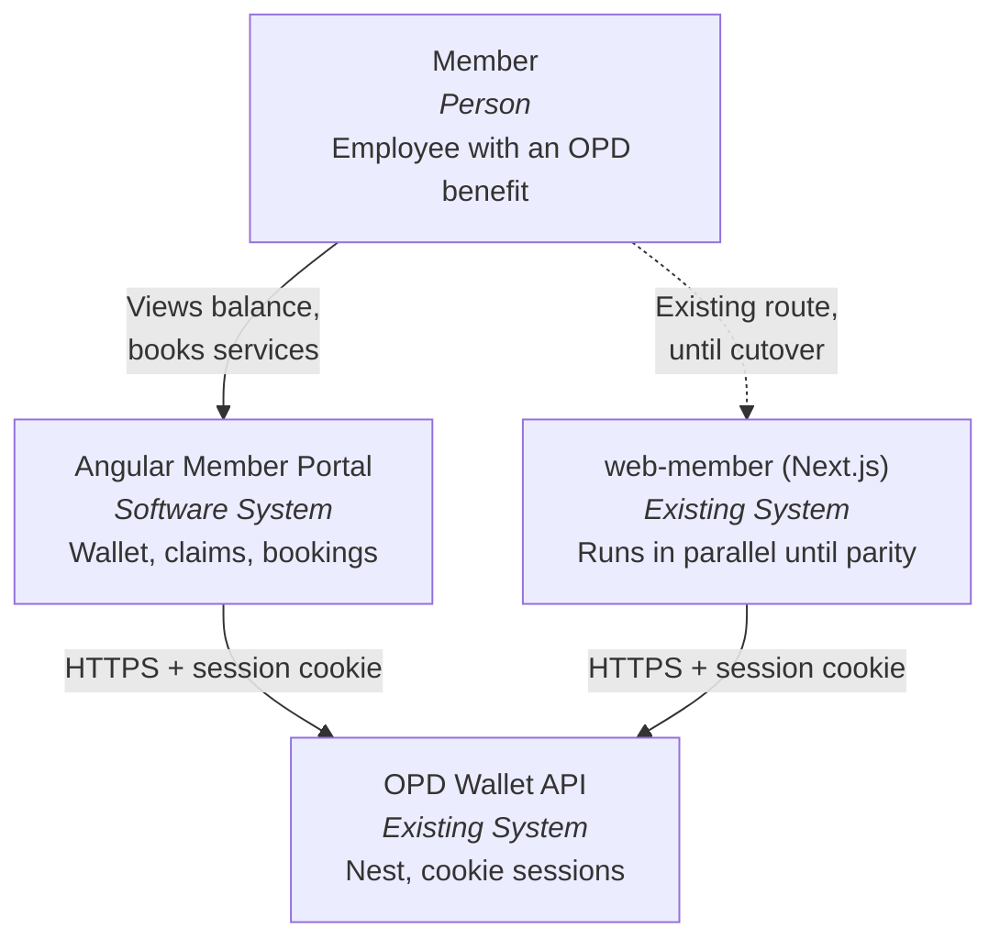
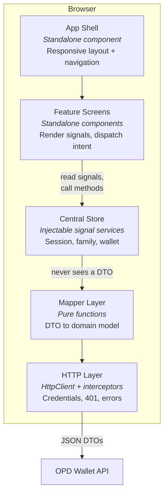

## Context

The member portal today is `web-member`: Next.js 14 app router, React 18, TanStack Query, axios, Tailwind, **62 routes under `/member`** (63 pages in total — the login screen is at `/`). Its state is split three ways — TanStack Query caches per screen, one `FamilyContext` for the active family member, and per-page `useState` for everything else. There is no domain layer: `lib/api/types.ts` declares transport shapes (`_id`, `REL003`, `CAT002`, ISO date strings) and components consume them directly, so every screen re-derives the same label lookups from `lib/utils/mappers.ts`.

Two behaviours in the reference are defects and are deliberately not carried over:

- `components/layout/ResponsiveLayout.tsx` falls back to a hardcoded mock user (`John Doe`, `OPD000001`) when `/api/auth/me` fails, presenting an unauthenticated visitor as signed in.
- `lib/api/wallet.ts` `getBalance` calls `this.getWallet` from an arrow function in an object literal, where `this` is not the API object.

Constraints:

- `web-member` is read-only reference for the duration of this migration. Both portals run side by side until parity.
- `api/` does not change. Every shape difference is absorbed on the Angular side.
- `web-angular/` already exists: `angular.json` with a `shell-tpa` stub, root `tsconfig.json` with `strict`, `strictTemplates`, `noPropertyAccessFromIndexSignature`. No `package.json` yet, so no version is pinned anywhere in the workspace. The stub is generated v20-era output (signals, `@for`/`track`, `provideBrowserGlobalErrorListeners`, `@angular/build` builders).
- The portal targets **Angular 21**.
- Session is a cookie the API sets; the browser sends it with credentialed requests. No bearer token to store.
- One responsive app serves mobile and desktop. No separate mobile build.

## Goals / Non-Goals

**Goals:**

- One central store for the member domain, built on Angular signals, that every screen reads from and no screen bypasses.
- A mapper boundary that translates transport DTOs to domain models exactly once, so no component sees `_id`, a relationship code, a category code, a raw ISO string, or a bare number that is really money.
- One responsive layout and one route tree serving every viewport width.
- A wallet vertical slice proving the store, mappers, shell, and session handling hold together end to end.
- Patterns concrete enough that the remaining routes are mechanical to add.

> **Verified counts (audit, 2026-08-07).** Superseding every earlier estimate in this document:
> **React 63 pages** (62 under `/member`, 1 login at `/`) · **Angular 60 `/member` routes** —
> 16 of them emitted by two `flatMap` loops, so counting `path:` literals undercuts by 12 ·
> **RN 57 screens**, of which **26 have no React counterpart**. Of those 26, only **6** are
> absent functionality (vaccination ×5, a combined carts list); the other 19 are RN route
> names for flows Angular already ships. See
> `web-angular/projects/member/audit/00-inventories/`.

**Non-Goals:**

- Feature parity with `web-member`. This change delivers the foundation plus wallet only.
- Any change to `api/`, to `web-member`, or to the `shell-tpa` stub.
- Server-side rendering. The reference portal is client-rendered behind a login; SSR buys nothing here and complicates the cookie-session flow.
- A shared component library across the six web apps. Premature until a second Angular app needs it.
- Micro-frontend composition between `shell-tpa` and `member`. They are independent applications in one workspace.

## Decisions

### Decision 0 — Angular 21, zoneless, standalone

Pin the workspace to `~21.2` (the v21 LTS line, `21.2.19` at time of writing) and the CLI to the matching major. Angular 22 is the current `latest` on npm; 21 is chosen deliberately so the workspace sits on a supported LTS line rather than tracking the newest major during a port.

Run **zoneless** (`provideZonelessChangeDetection()`, no `zone.js`). This app's state is signals from top to bottom — there is no zone-dependent code to migrate, no `setTimeout`-driven view update to preserve, and no third-party widget assuming patched globals. Adopting zoneless at greenfield costs nothing; retrofitting it later means auditing every screen.

Standalone components throughout. No NgModules.

*Alternatives considered.* Angular 22 (`latest`): newer, but puts a large port on a major that will itself need an upgrade before this migration finishes. Angular 20, matching the stub's generated output: no reason to start a new app one major behind LTS. Keeping `zone.js`: only justified by zone-dependent dependencies, and this app has none.

*Trade-off accepted.* The `shell-tpa` stub was generated by a v20-era CLI. Since the workspace has no `package.json`, installing 21 sets the version for both projects; the stub is a placeholder with an empty route table, so this is a version bump it does not notice. It is otherwise not modified.

*Verification.* Zoneless plus `strictTemplates` on a fresh workspace is asserted here, not observed — the build has not been run. The first task confirms the workspace builds and serves before any feature work starts.

### C4 Level 1 — System context

Both portals are peers against one unchanged API. Neither holds authority over balances.

### C4 Level 2 — Containers inside the portal

The arrows are one-directional by design: a feature never calls `HttpClient`, and a mapper never reaches back into the store.

### Decision 1 — Central store as injectable signal services

Root-provided services holding `signal()` state with `computed()` derivations. `SessionStore`, `FamilyStore`, `WalletStore` for this change; one store per domain area as later changes land.

State is written only by the owning store's own methods; the signals are exposed to components read-only (`.asReadonly()`). Cross-store dependencies are `computed()`, not manual subscription — `WalletStore` derives its target member from `FamilyStore.activeMember()`, so a family switch invalidates the wallet automatically with no event wiring. That is the mechanism behind the "already-open screen follows the switch" scenario in `member-family-context`.

*Alternatives considered.* Classic NgRx: actions, reducers, effects, and selectors for state this size is boilerplate a small team pays for on every screen — rejected, and the user ruled it out explicitly. NgRx SignalStore: closer, but adds a dependency for structure that `signal` + `computed` + a class already provide. TanStack Query for Angular: would carry the reference's model over, where the cache *is* the state and there is no domain layer — that is the problem being fixed. Per-component state: no single source of truth for the active member, which is the specific defect being corrected.

*Trade-off accepted.* No devtools time-travel and no automatic request deduplication. Deduplication is handled per store by holding an in-flight promise; if this becomes a real pain point, NgRx SignalStore is a contained migration because the public surface is already signals.

### Decision 2 — Mapper boundary, DTO to domain

Each resource gets a `*.dto.ts` (transport shape, mirrors what the API actually returns), a `*.model.ts` (domain model the app uses), and a `*.mapper.ts` (pure `toDomain` function, and `toDto` only where the app writes). Stores call mappers; components receive domain models only.

The mapper is where the reference's scattered lookups collapse into one place:

| Transport | Domain |
|---|---|
| `_id: string` | `id: string` |
| `relationship: 'REL003'` | `relationship: Relationship.Son` |
| `categoryCode: 'CAT002'` | `category: BenefitCategory.Pharmacy` |
| `appointmentDate: '2026-08-05T...'` | `date: Date` |
| `billAmount: 1250` | `amount: Money` |
| `status: string` (free-form) | discriminated union + `isTerminal` |

Unknown codes degrade rather than throw. An unrecognised relationship maps to a neutral label; an unrecognised category keeps the API-supplied `categoryName` as its label. This is what makes the "unrecognised relationship" and "unrecognised category" scenarios pass, and it means an API adding a category code cannot blank a member's wallet screen.

*Alternatives considered.* Consuming DTOs directly, as the reference does: rejected — it is the root cause of the duplicated lookups. Runtime schema validation (zod/io-ts) at the boundary: real value, but it is a new dependency and a strictly larger change; the mappers are the seam where it can be added later without touching a single component. Auto-generating types from an OpenAPI spec: the API does not publish one today.

*Trade-off accepted.* Mappers are hand-written and drift from the API silently. Mitigated by keeping DTO types adjacent to their mapper, and by the mapper being the only file to change when the API does.

### Decision 3 — Responsive as one layout, not two

A single `MemberShell` component and one route tree. The layout switches presentation at a CSS breakpoint: persistent sidebar at and above `md` (768px, matching the reference's `md:pl-64 lg:pl-72`), bottom tab bar plus header below it. Both navigation surfaces render from **one** destination list, so parity is structural rather than something to keep in sync by hand.

No `User-Agent` sniffing, no `/m/` route prefix, no separate build target. Where a viewport-dependent decision genuinely cannot be expressed in CSS, it reads a breakpoint signal backed by `matchMedia` — so it stays reactive on resize rather than sampling width once at load.

*Alternatives considered.* Separate mobile and desktop component trees: doubles the surface for every one of the 62 reference routes. Device detection with redirect: breaks the shared-URL scenario and is wrong on tablets and resizes.

*Trade-off accepted.* Both navigation surfaces exist in the DOM at all widths, hidden by CSS. At this component count that is cheaper than the alternatives; if it ever matters, `@defer` on the hidden surface is the escape hatch.

### Decision 4 — HTTP layer with functional interceptors

Three interceptors, registered via `provideHttpClient(withInterceptors([...]))`:

1. **Credentials** — sets `withCredentials` so the session cookie travels, matching the reference's axios config.
2. **Session** — on any 401, calls `SessionStore.terminate()` once and routes to login. Centralising this is what makes the "session rejected mid-session" scenario hold no matter which screen issued the request; the reference does this inside an axios interceptor by assigning `window.location.href`, which discards Angular's router state.
3. **Error normalisation** — converts `HttpErrorResponse` into a domain `AppError` (`kind: 'network' | 'server' | 'notFound' | 'validation'` plus a member-safe message), so screens render error state from one shape rather than inspecting status codes.

*Alternatives considered.* Keeping axios: works, but discards `HttpClient`'s interceptor and testing story for no gain. Per-service error handling: the reference does this and the results are inconsistent across screens.

### Decision 5 — Tailwind, tokens shared with the reference

The Angular app uses Tailwind with the design tokens from `web-member/tailwind.config.ts` (`brand-*`, `ink-*`, `surface-*`) copied across. Copied, not imported — importing would couple a read-only app to a live one.

*Alternatives considered.* Angular Material: a different visual language from the existing portal, and members would see two products. Plain SCSS: gives up the utility vocabulary the team already writes.

*Trade-off accepted.* Two token files that can drift. Acceptable while the reference is frozen; the tokens become canonical in the Angular app at cutover.

### Decision 6 — Lazy standalone routes

Routes are standalone components with `loadComponent`, grouped by feature area, with a functional `authGuard` (`CanActivateFn`) on the member subtree. Auth state is read from `SessionStore`, which is also what `APP_INITIALIZER`-equivalent bootstrap uses to attempt session restore before the first route resolves — that ordering is what prevents a flash of the login screen on reload with a valid session.

*Alternatives considered.* NgModules: superseded. Eager routes: at 60 screens the initial bundle would blow the 1MB production budget already configured in `angular.json`.

## Risks / Trade-offs

- **Two member portals live at once, and they can diverge behaviourally** → Neither portal holds client-side authority over balances or eligibility; both read the same API. The Angular app stays on its own route/host until parity, so no member sees both.
- **Hand-written mappers drift from the API** → DTO types live beside their mapper so a change is one file. Unknown-code degradation means drift shows as a neutral label, not a crashed screen. Runtime validation at the mapper seam is the upgrade path if drift becomes routine.
- **Signals store lacks request deduplication, so a family switch could fire duplicate loads** → Each store holds its in-flight request and returns it to concurrent callers.
- **`strictTemplates` plus `noPropertyAccessFromIndexSignature` on a large port is friction** → Kept on. It is exactly what catches the DTO-shaped access this change exists to eliminate; relaxing it would let transport shapes back into templates.
- **The reference's mock-user fallback is load-bearing for someone's local workflow** → It is specified against (`member-session`, "Authentication service unreachable"). If a local stub is wanted, it belongs behind an explicit dev flag, never in the auth path.
- **Wallet-only slice may not exercise enough of the API surface to validate the mapper pattern** → Wallet covers nested balances, a code-keyed collection, an unlimited/exhausted variant, pagination, and money and date formatting. If a later vertical breaks the pattern, that is cheap to learn now and expensive to learn at route 40.
- **`shell-tpa` stub shares the workspace and its root `tsconfig.json`** → The `member` project gets its own `tsconfig.app.json` extending the root. The stub is not modified.

## Migration Plan

1. Add `package.json` and lockfile to `web-angular/` pinning Angular `~21.2` and the matching CLI; register the `member` project in `angular.json` alongside `shell-tpa`; confirm a zoneless build and serve. The stub is untouched.
2. Build the HTTP layer, mapper conventions, and `SessionStore` — nothing member-visible yet.
3. Build the responsive shell with the full destination list; unimplemented destinations route to a placeholder screen.
4. Build `FamilyStore` and the family-member selector.
5. Build `WalletStore`, the wallet screen, and transaction history.
6. Deploy to a separate route/host. `web-member` continues to serve members.

**Rollback.** The Angular app is additive — no shared file, no API change, no data migration. Rollback is not deploying it, or removing its route. `web-member` is unaffected at every step because it is never modified.

**Cutover** (a later change, not this one): route members to the Angular portal once parity is reached, keep `web-member` deployed but unrouted for one release, then delete it.

## Open Questions

1. **Where does the Angular portal deploy?** Separate host, a path prefix behind the existing nginx, or a new container in `docker-compose`? This does not block the specs but does block task 1 of the deployment work. Reference: `nginx/` and `docker-compose.prod.yml`.
2. ~~**Is there an API endpoint that returns the member's wallet without the caller supplying a policy assignment id?**~~ **Resolved.** `GET /wallet/balance?userId=` and `GET /wallet/transactions?userId=` take an optional `userId` and default to the caller; the controller resolves the assignment and plan config itself, and enforces family access server-side. `WalletStore` therefore has no dependency on a policy store. The reference portal's `walletApi.getWallet(userId, assignmentId)` is stale against the current API.

   Consequence found while implementing: `GET /wallet/balance` returns no `effectiveFrom`/`effectiveTo`, so the wallet screen **cannot** identify the policy period that `member-wallet` requires. Either source it from `GET /member/profile` assignments — which reintroduces the policy dependency for that one field — or amend the spec. Tracked as task 6.4.
3. **Should the portal support a member with more than one concurrent active policy?** `MemberProfileResponse.assignments` is an array. The reference effectively assumes one. If multiple are real, `member-wallet` needs a policy-selection requirement.
4. **Session idle timeout** — is expiry purely server-side, or should the portal warn before it? Currently specified as reactive only: the portal responds to a 401, it does not track expiry.
5. **Accessibility target.** Not stated. Keyboard navigation and visible focus are assumed baseline; if WCAG 2.1 AA is a contractual requirement, it belongs in `member-shell` as testable requirements rather than as an implementation habit.

No in-force ADRs exist — `adr/` is empty, so nothing constrains this design. The ADR step records the first set.
